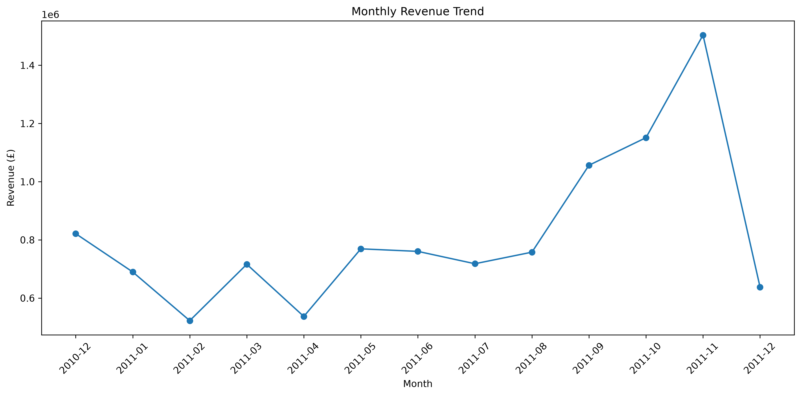
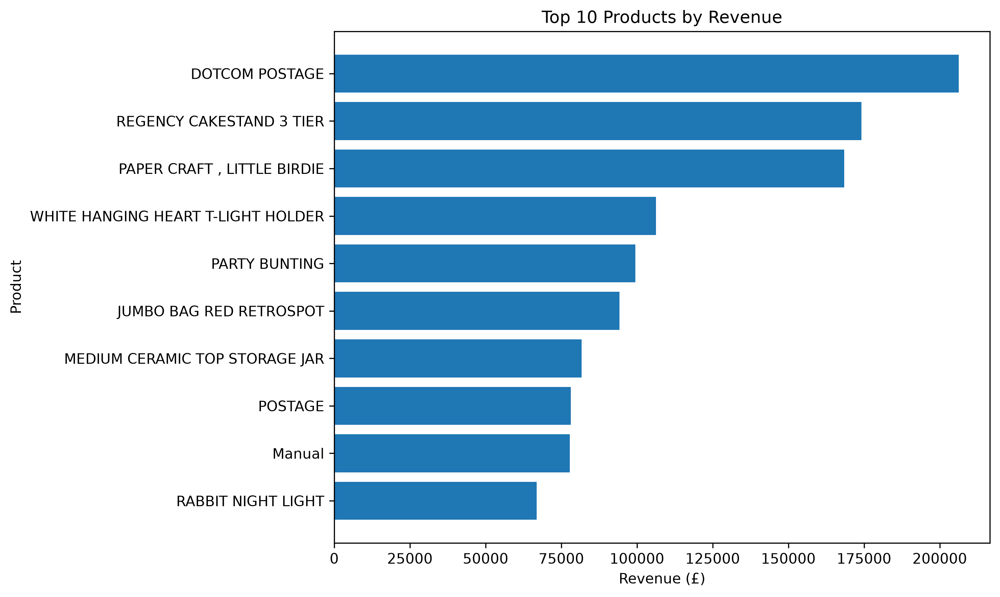
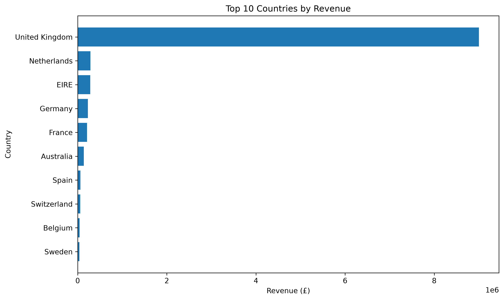
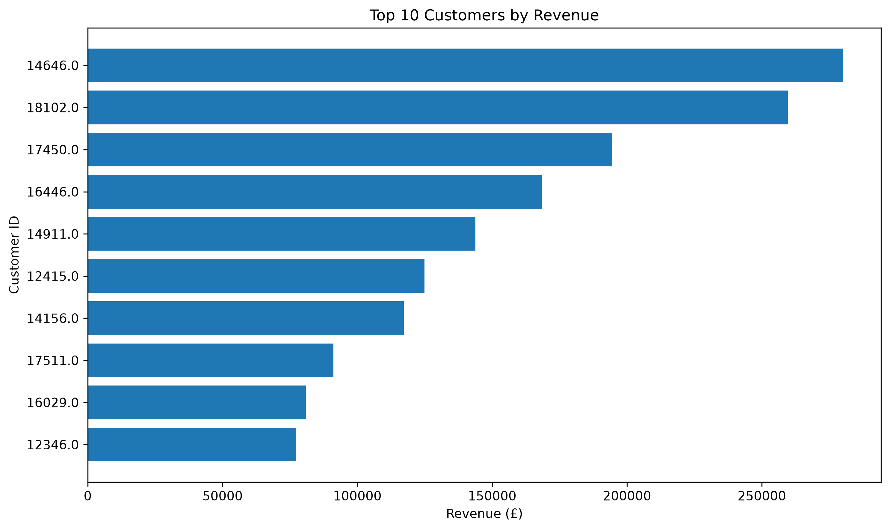
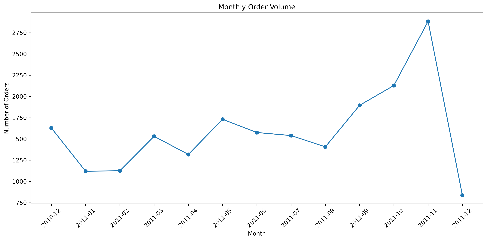
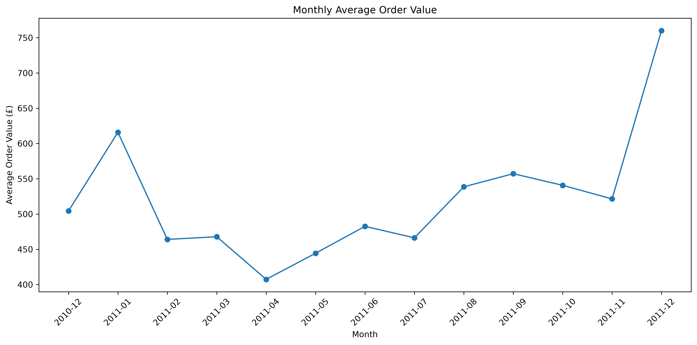
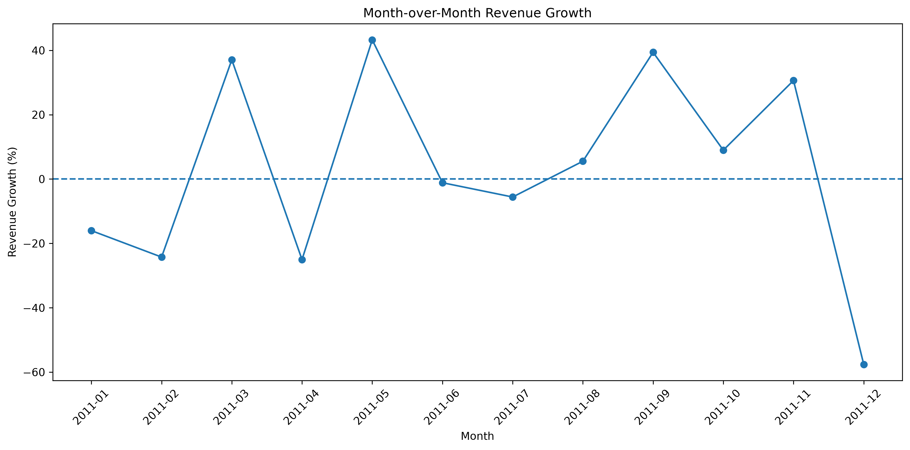
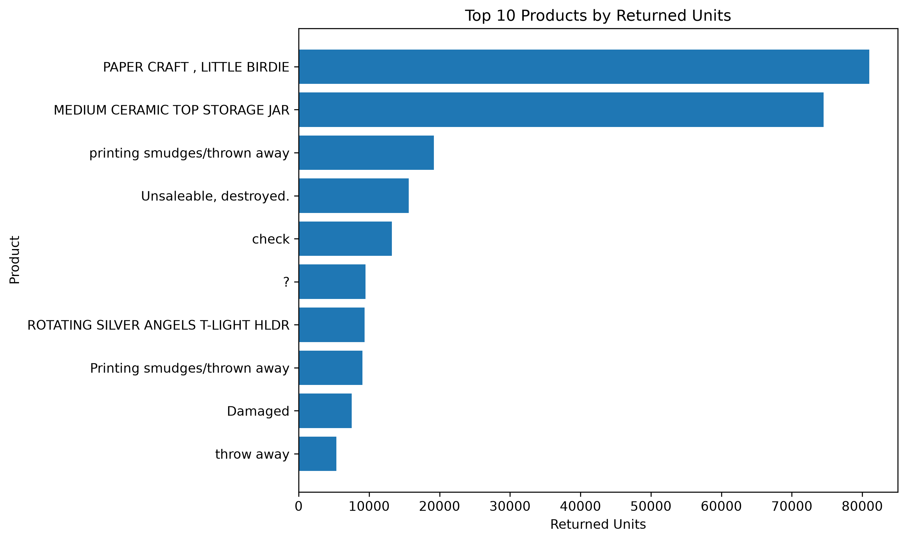

# E-Commerce Sales Analysis

## 📌 Project Overview

This project analyses an e-commerce transaction dataset to understand sales performance, product performance, customer behaviour, geographic markets, returns and monthly trends.

The project was completed using Python and Pandas, with Matplotlib used for data visualization.

The analysis covers approximately 541,000 transactions from December 2010 to December 2011.

---

## 🎯 Business Questions

The analysis aims to answer the following questions:

1. How much total revenue did the business generate?
2. Which products generate the most revenue?
3. Which products have the highest sales volume?
4. Which months generate the highest revenue?
5. Which months have the highest order volume?
6. How does Average Order Value change over time?
7. Which countries generate the most revenue?
8. How concentrated is revenue in the UK?
9. Which customers generate the most revenue?
10. Which products have the highest return volumes?
11. When did revenue experience the strongest growth or decline?

---

## 📊 Key Performance Indicators

| Metric | Result |
|---|---:|
| Total Revenue | £10.64M |
| Total Orders | 20,726 |
| Total Units Sold | 5.65M |
| Unique Customers | 4,339 |
| Unique Products | 4,077 |
| Countries | 38 |
| Average Order Value | £513.47 |

---

## 🔍 Key Findings

### Monthly Performance

November 2011 generated the highest monthly revenue at approximately **£1.50 million**.

November also recorded the highest order volume with **2,884 orders**.

### Geographic Performance

The United Kingdom is the dominant market, generating approximately **£9.00 million**, equivalent to **84.59% of total revenue**.

The Netherlands and EIRE were the next largest markets by revenue.

### Customer Performance

The dataset contains **4,339 identifiable customers**.

A relatively small number of high-value customers contribute substantial revenue to the business.

### Returns

The analysis identified **10,624 return/cancellation transactions** involving approximately **484,531 units**.

Several products showed unusually high return volumes and may require further investigation.

### Growth

May 2011 recorded the highest month-over-month revenue growth at approximately **43.27%**.

December 2011 recorded the largest apparent decline at approximately **-57.59%**.

However, December 2011 is an incomplete month because the dataset ends on **9 December 2011**.

---

## 📈 Visualizations

### Monthly Revenue



### Top Products by Revenue



### Top Countries by Revenue



### Top Customers by Revenue



### Monthly Order Volume



### Monthly Average Order Value



### Monthly Revenue Growth



### Products with Highest Returned Units



---

## 💡 Business Recommendations

### 1. Reduce dependence on the UK market

Approximately 84.59% of revenue comes from the UK. Expanding successful products into international markets could reduce geographic concentration.

### 2. Focus on high-value customers

High-value customers contribute substantial revenue. Customer retention and loyalty strategies could help protect this revenue base.

### 3. Investigate high-return products

Products with unusually high return volumes should be investigated to understand whether returns are related to product quality, customer expectations, fulfilment or other operational factors.

### 4. Investigate seasonal patterns

November was the strongest month for revenue and orders. Further analysis could investigate the effects of seasonal demand, promotions and marketing campaigns.

### 5. Explore international markets

The Netherlands and EIRE were among the strongest international markets. Their customer and product patterns could be investigated to identify opportunities for expansion.

---

## 🧹 Data Quality Considerations

The analysis identified several data-quality considerations:

- 5,268 duplicate rows were identified in the original dataset.
- Some transactions do not contain Customer IDs.
- Negative quantities represent returns or cancellations.
- Some transactions contain operational descriptions such as postage or adjustments.
- December 2011 is an incomplete month.

These factors were considered when interpreting the results.

---

## 🛠️ Technologies Used

- Python
- Pandas
- Matplotlib
- Jupyter Notebook
- OpenPyXL
- GitHub

---

## 📁 Project Structure

```text
ecommerce-sales-analysis/
│
├── data/
├── images/
├── notebooks/
├── .gitignore
├── README.md
└── requirements.txt